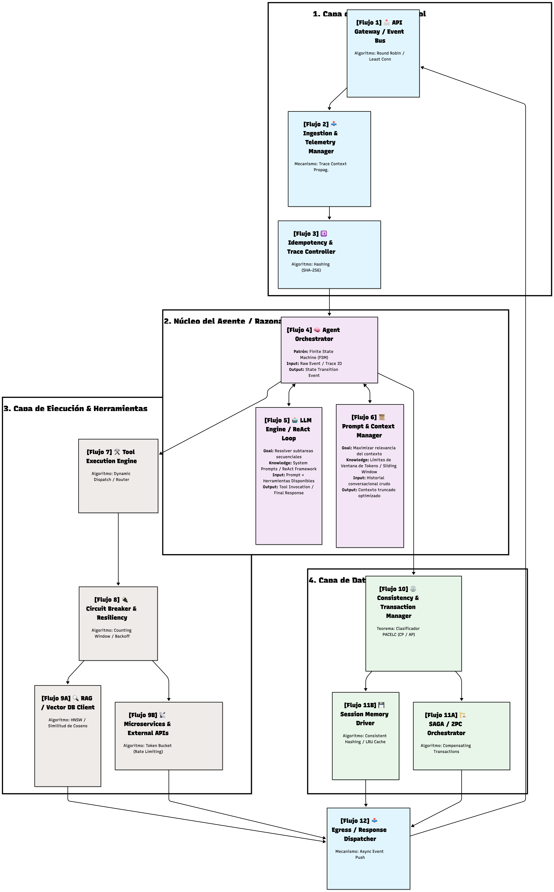
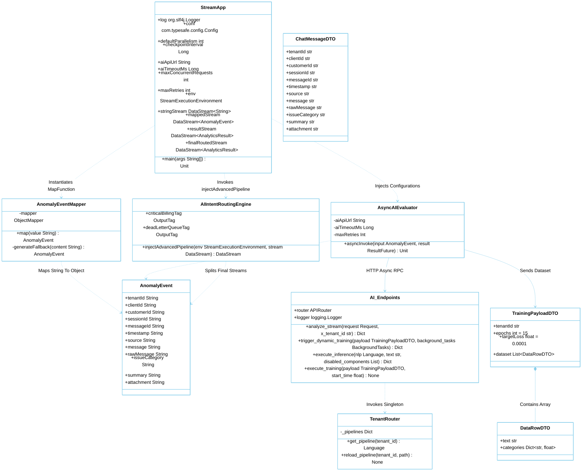

# PoC🪐 AI & Analytics Streaming Pipeline

Ulti-tenant de alta disponibilidad diseñada para la ingesta, serialización y clasificación probabilística de interacciones de mensajería en tiempo real. El ecosistema implementa una arquitectura desacoplada basada en eventos (*Event-Driven Architecture*) combinando microservicios reactivos en Scala y motores analíticos asíncronos de Inteligencia Artificial en Python.


---

## 📐 Radiografía de la Arquitectura Distribuida

<div style="overflow-x: auto;">
<pre>
========================================================================================================================
                          🪐 DIAGRAMA GLOBAL DE ARQUITECTURA
========================================================================================================================

   [ TRÁFICO PERIMETRAL ] (Chatbots / APIs de Mensajería Omnicanal)
             │
             ▼ [ POST HTTP/2 Multiplexado ] (Contrato Estricto de 12 Campos JSON)
   ┌────────────────────────────────────────────────────────────────────────────────────────────────────────────────┐
   │ 🌐 CAPA DE ENRUTAMIENTO INMUNE (Ingress Localhost Gateway)                                                     │
   │   └── Balanceador de Carga / API Gateway Endpoint: http://localhost:8082                                       │
   └────────────────────────────────────────────────────────────────────────────────────────────────────────────────┘
             │   ┌──────────────────────────────────────────────────────────────────────────────────────────────────┐
   │ 🔀 NIVEL 1: CAPA DE INGESTA RECOLECTORA Y DESACOPLAMIENTO ASÍNCRONO (Edge Ingestion)                           │
   │                                                                                                                │
   │   ┌────────────────────────────────────────────────────────┐                                                   │
   │   │  📦 COMPONENTE MICROSERVICIO: custom-api               │                                                   │
   │   │  [ Motor de Red: Akka HTTP Reactive Server / Scala ]   │                                                   │
   │   │  - Validación de Firma Corporativa de Cabeceras        │                                                   │
   │   └────────────────────────────────────────────────────────┘                                                   │
   │                               │                                                                                │
   │                               ▼ [ Inyección de Eventos No Bloqueante / Fan-Out Pattern ]                       │
   │   ┌────────────────────────────────────────────────────────┐                                                   │
   │   │  📦 COMPONENTE BROKER: pulsar-standalone-broker        │                                                   │
   │   │  [ Motor de Colas: Apache Pulsar Enterprise Broker ]   │                                                   │
   │   │  - Absorción Completa de Picos Masivos (Backpressure)  │                                                   │
   │   └────────────────────────────────────────────────────────┘                                                   │
   └────────────────────────────────────────────────────────────────────────────────────────────────────────────────┘
             │
             ▼ [ Canal de Streaming Persistente: persistent://public/default/chat-messages-raw ]
   ┌────────────────────────────────────────────────────────────────────────────────────────────────────────────────┐
   │ 🦫 NIVEL 2: PROCESAMIENTO DISTRIBUIDO EN PARALELO Y SERIALIZACIÓN (Streaming Engine)                           │
   │                                                                                                                │
   │   ┌────────────────────────────────────────────────────────┐                                                   │
   │   │  📦 COMPONENTE MASTER: flink-jobmanager                │                                                   │
   │   │  [ Motor: Apache Flink Distributed Coordinator ]       │                                                   │
   │   │  - Coordinación, Resiliencia y Monitoreo del Grafo     │                                                   │
   │   └────────────────────────────────────────────────────────┘                                                   │
   │                               │                                                                                │
   │                               ▼ [ Ruteo de Tareas del Grafo de Datos ]                                         │
   │   ┌────────────────────────────────────────────────────────┐       🗄️ PERSISTENCIA DE ARTEFACTOS BINARIOS      │
   │   │  📦 COMPONENTE WORKER: flink-taskmanager               │ ════> [ Path Local: ./target/artifacts ]          │
   │   │  [ Motor: Apache Flink Processing Agent / Java 11 ]    │       [ Path Contenedor: /tmp/artifacts ]         │
   │   │  - Serializa Mensajes JSON a Binarios de Protobuf v3   │       - Despliega: ai-nlp-stream-agent.jar        │
   │   └────────────────────────────────────────────────────────┘                                                   │
   └────────────────────────────────────────────────────────────────────────────────────────────────────────────────┘
             │
             ▼ [ POST Binario Multiplexado / Content-Type: application/x-protobuf / Intramesh Capa 3 ]
   ┌────────────────────────────────────────────────────────────────────────────────────────────────────────────────┐
   │ 🧠 NIVEL 3: CEREBRO ANALÍTICO DE EXTRACCIÓN E INTELIGENCIA ARTIFICIAL (Inference Engine)                       │
   │                                                                                                                │
   │   ┌────────────────────────────────────────────────────────┐       🗄️ MONTAJE DE RECURSOS REAL TIME            │
   │   │  📦 COMPONENTE CORE IA: nlp-brain-engine               │ ════> [ Path Local: ./nlp-ml-brain/src ]          │
   │   │  [ Motor: FastAPI Ingestion Framework / Python 3.12 ]  │       [ Path Local: ./nlp-ml-brain/models_store ] │
   │   │  - Orquestador Web: Gunicorn (1 Worker Elástico)       │       - Sincronización In-Memory de Modelos       │
   │   │  - Entorno de Red Confinado: PYTHONPATH=/app           │                                                   │
   │   │  - Puerto de Comunicación del Endpoint: :8000          │                                                   │
   │   └────────────────────────────────────────────────────────┘                                                   │
   │                               │                                                                                │
   │                               ▼ [ Inferencia Asíncrona No Bloqueante / asyncio.to_thread ]                     │
   │   ┌────────────────────────────────────────────────────────┐                                                   │
   │   │  🧮 COMPONENTE MATEMÁTICO: Model Registry              │                                                   │
   │   │  [ Algoritmo: spaCy Convolutional Neural Network ]     │                                                   │
   │   │  - Optimización: select_pipes(disable=['ner','parser'])│                                                   │
   │   │  - Aislamiento Completo de Tensores para TextCat       │                                                   │
   │   └────────────────────────────────────────────────────────┘                                                   │
   └────────────────────────────────────────────────────────────────────────────────────────────────────────────────┘
             │
             ▼
   [ EMISIÓN DEL DICTAMEN ANALÍTICO ] ──> {"intent": "BILLING_SUPPORT", "confidence": 0.9981, "sentiment": -0.75}
   🪐 Patrón de Resiliencia: Fallback Automático a Base Global [es_core_news_sm] en caso de Directorio Inexistente.

========================================================================================================================

</pre>
</div>

El flujo transaccional opera bajo el patrón de abanico (*Fan-Out Pattern*) garantizando latencias lineales sub-milisegundo de extremo a extremo:

1. **Perímetro (Akka HTTP / HTTP/2)**: Captura las tramas JSON de los Chatbots, valida el contrato rígido de 12 campos y las inyecta como un búfer asíncrono no bloqueante.
2. **Distribución (Apache Pulsar)**: Funciona como el *Broker* de mensajería de alta fidelidad para el desacoplamiento de carga transaccional masiva.
3. **Procesamiento (Apache Flink)**: Consume el stream asíncrono, serializa las tramas a bloques compactos de Google Protobuf v3 y orquesta las llamadas simultáneas al motor de IA.
4. **Inferencia (FastAPI + spaCy CNN)**: Ejecuta los pesos matemáticos del clasificador supervisado en la memoria RAM utilizando un Model Registry modular (`TenantRouter`).

---


# 🏗️ Arquitectura de Componentes Internos del Agente de IA

El agente de IA está diseñado bajo una arquitectura modular y desacoplada. Cada componente interno tiene una responsabilidad única, ejecuta algoritmos específicos de ciencias de la computación y se comunica de forma segura para garantizar la resiliencia en entornos distribuidos.

### 🗺️ Diagrama de Componentes, Flujos y Algoritmos

<div align="center">
  
</div>


### 🧩 Especificación Técnica de Componentes: Entradas, Salidas y Algoritmos

#### 1. Capa de Entrada y Control

*   **[Flujo 1] API Gateway / Event Bus:**
    *   **Descripción:** Punto único de entrada al clúster distributed que balancea la carga de peticiones e hilos del sistema.
    *   **Algoritmo:** *Round Robin* o *Least Connections*.
    *   **Input:** Petición HTTP cruda o Evento de red (`User Prompt JSON`).
    *   **Output:** Petición enrutada internamente hacia el gestor de telemetría.

*   **[Flujo 2] Ingestion & Telemetry Manager:**
    *   **Descripción:** Valida la estructura de los datos entrantes e inyecta instrumentación de observabilidad distribuida.
    *   **Algoritmo/Mecanismo:** *Trace Context Propagation (W3C Standard)*.
    *   **Input:** HTTP/Event Request validado estructuralmente.
    *   **Output:** Payload enriquecido con un identificador global único (`Trace ID`).

*   **[Flujo 3] Idempotency & Trace Controller:**
    *   **Descripción:** Filtra transacciones duplicadas para evitar doble procesamiento y sobrecostos innecesarios en el LLM.
    *   **Algoritmo:** *Hashing criptográfico (SHA-256)* acoplado a lecturas key-value O(1).
    *   **Input:** Payload con `Idempotency Key` y `Trace ID`.
    *   **Output:** Petición inédita autorizada para procesamiento (o respuesta histórica inmediata si era un duplicado).

#### 2. Núcleo del Agente / Razonamiento (MAS Engine)

*   **[Flujo 4] Agent Orchestrator:**
    *   **Descripción:** Cerebro central reactivo que controla las transiciones lógicas del ciclo de vida del agente.
    *   **Patrón/Algoritmo:** *Finite State Machine (FSM)* / Máquina de Estados Finitos.
    *   **Input:** Evento limpio y autorizado (`Payload JSON` + `Trace ID`).
    *   **Output:** Evento de transición de estado interno que gatilla al LLM o despacha el retorno.

*   **[Flujo 5] LLM Engine / ReAct Loop:**
    *   **Descripción:** Unidad cognitiva del agente que desglosa problemas y decide los caminos de ejecución.
    *   **Goal:** Resolver subtareas secuenciales de forma autónoma.
    *   **Knowledge:** Framework *ReAct (Reason + Act)*, directrices de comportamiento y esquemas JSON de APIs.
    *   **Input:** Prompt de usuario, directrices de sistema y meta-descripción de herramientas disponibles.
    *   **Output:** Solicitud de invocación de herramienta (`Tool Call JSON`) o respuesta conversacional final.

*   **[Flujo 6] Prompt & Context Manager:**
    *   **Descripción:** Mantiene la memoria RAM de la sesión limpia, empaquetando el contexto óptimo para el modelo.
    *   **Goal:** Maximizar relevancia contextual evitando desbordar la ventana de tokens.
    *   **Knowledge:** Límites de la ventana de contexto física del LLM.
    *   **Algoritmo:** *Sliding Window (Ventana Corrediza)* y estrategias de truncamiento prioritario.
    *   **Input:** Historial crudo de la conversación desde la base de datos distribuida.
    *   **Output:** Prompt contextualizado y recortado a la medida exacta del LLM.

#### 3. Capa de Ejecución & Herramientas

*   **[Flujo 7] Tool Execution Engine:**
    *   **Descripción:** Enrutador dinámico de código que traduce las intenciones del LLM en acciones del sistema real.
    *   **Algoritmo:** *Dynamic Dispatch* (Despacho Dinámico) en tiempo de ejecución.
    *   **Input:** Bloque de comandos estructurado (`Tool Call JSON`).
    *   **Output:** Llamada técnica nativa hacia el módulo de resiliencia.

*   **[Flujo 8] Circuit Breaker & Resiliency Module:**
    *   **Descripción:** Disyuntor que intercepta caídas en cascada aislando microservicios lentos o caídos.
    *   **Algoritmo:** *Counting Window* (Ventana de Conteo de Errores) y *Exponential Backoff con Jitter*.
    *   **Input:** Comando de ejecución de herramienta saliente.
    *   **Output:** Payload de ejecución seguro (o Fallback controlado de error inmediato si el circuito está abierto).

*   **[Flujo 9A] RAG / Vector DB Client:**
    *   **Descripción:** Proveedor de conocimiento semántico a largo plazo a través de base de datos vectoriales.
    *   **Algoritmo:** *HNSW (Hierarchical Navigable Small World)* y métrica de *Similitud de Coseno*.
    *   **Input:** Query o cadena textual a vectorizar.
    *   **Output:** Colección de documentos embebidos con mayor cercanía semántica (`Context Blocks`).

*   **[Flujo 9B] Microservices & External APIs:**
    *   **Descripción:** Cliente de salida que interactúa directamente con APIs de terceros y servicios de negocio Core.
    *   **Algoritmo:** *Token Bucket* / *Leaky Bucket* (Algoritmos de Rate Limiting).
    *   **Input:** Request REST / gRPC parametrizado.
    *   **Output:** Response JSON con datos vivos del sistema externo externo.

#### 4. Capa de Datos y Consistencia (Manejo de Estados)

*   **[Flujo 10] Consistency & Transaction Manager:**
    *   **Descripción:** Clasifica el tipo de salida del agente según las reglas del Teorema PACELC para balancear la velocidad y la seguridad de los datos.
    *   **Teorema:** Clasificador PACELC (CP / AP).
    *   **Input:** Evento final de respuesta o mutación generado por el orquestador.
    *   **Output:** Enrutamiento transaccional (CP / SAGA) o de consistencia eventual (AP / Memoria).

*   **[Flujo 11A] SAGA / 2PC Orchestrator:**
    *   **Descripción:** Garantiza transacciones distribuidas atómicas y consistentes (ACID) entre bases de datos desacopladas.
    *   **Algoritmo:** Compensating Transactions (Transacciones de Compensación / Reversión).
    *   **Input:** Comandos distribuidos de escritura de negocio (ej. cobros, inventario).
    *   **Output:** Confirmación global de guardado seguro (o Rollback coordinado en caso de fallos intermedios).

*   **[Flujo 11B] Session Memory Driver:**
    *   **Descripción:** Driver de alta velocidad para salvar el historial conversacional y estados de sesión asíncronos.
    *   **Algoritmos:** Consistent Hashing (Distribución de carga en anillo) y desalojo LRU (Least Recently Used).
    *   **Input:** Bloque de memoria conversacional nuevo a guardar en base NoSQL (ej. Redis / Cassandra).
    *   **Output:** Flag de persistencia exitosa O(1).

#### 5. Capa de Salida

*   **[Flujo 12] Egress / Response Dispatcher:**
    *   **Descripción:** Módulo encargado de consolidar los artefactos de salida provenientes de herramientas o transacciones para su entrega limpia.
    *   **Mecanismo:** Async Event Push (Push de Eventos Asíncronos).
    *   **Input:** Data cruda procesada final o mensajes consolidados por el agente.
    *   **Output:** Payload unificado de respuesta inyectado de vuelta al API Gateway / Canal de salida del cliente.
    
---


### 🪐 Disgrama de Secuencia Ciclo de Inferencia y Re-Entrenamiento Asíncrono (Edición Ampliada)

```mermaid
%%{init: {
  'theme': 'base',
  'themeCSS': 'svg { width: 100% !important; height: 5500px !important; max-width: 100% !important; min-height: 5500px !important; } text, .actor, .note, .label, .messageText, span, tspan, .actor-description, text.small, .actor-text-description, .note text, text.noteText { fill: #000000 !important; color: #000000 !important; font-size: 26px !important; font-weight: bold !important; } .messageLine0, .messageLine1 { stroke: #87CEEB !important; stroke-width: 4px !important; } .messageText { fill: #000000 !important; color: #000000 !important; font-size: 26px !important; } .loopLine { stroke: #87CEEB !important; } .note, .note rect, rect.note { background-color: #ffffff !important; fill: #ffffff !important; stroke: #87CEEB !important; stroke-width: 3px !important; color: #000000 !important; font-size: 26px !important; } .active0, .active1, rect.activation { fill: #ffffff !important; stroke: #87CEEB !important; stroke-width: 3px !important; } .edgeLabel rect, .labelBox, g.labelBox rect { fill: #ffffff !important; stroke: #ffffff !important; } .label, .labelText, g.labelBox text { color: #000000 !important; fill: #000000 !important; font-size: 26px !important; } .actor, .actor-top rect, .actor-bottom rect, rect { fill: #ffffff !important; stroke: #87CEEB !important; stroke-width: 3px !important; } .actor text, g.actor text { fill: #000000 !important; color: #000000 !important; font-size: 26px !important; font-weight: bold !important; } g.messageBox rect, rect.messageBox { fill: #ffffff !important; stroke: #ffffff !important; }',
  'themeVariables': {
    'primaryColor': '#ffffff',
    'primaryTextColor': '#000000',
    'primaryBorderColor': '#87CEEB',
    'lineColor': '#87CEEB',
    'secondaryColor': '#ffffff',
    'tertiaryColor': '#ffffff',
    'background': '#ffffff',
    'actorBkg': '#ffffff',
    'actorBorder': '#87CEEB',
    'actorTextColor': '#000000',
    'actorLineColor': '#87CEEB',
    'labelBackground': '#ffffff',
    'edgeLabelBackground': '#ffffff',
    'textColor': '#000000',
    'fontSize': '26px',
    'boxMargin': 40,
    'messageMargin': 420,
    'useMaxWidth': false,
    'mirrorActors': true
  }
}}%%
sequenceDiagram
    autonumber
    actor API as Host (Python Script)
    participant F_Source as Flink SocketSource (:9999)
    participant F_Async as Flink AsyncAIEvaluator
    participant K8s_DNS as K3s CoreDNS Mesh
    participant API_Web as FastAPI AI-Endpoints (:8000)
    participant API_BG as FastAPI BackgroundTasks
    participant spaCy as spaCy CNN Engine
    participant Disk as Persistent Volume (HostPath)

    %% =============================================================================================
    %% PARTE 1: FLUJO DE INFERENCIA EN STREAMING CONTINUO
    %% =============================================================================================
    Note over Host, F_Source: ESCENARIO A: Pipeline de Streaming e Inferencia en Tiempo Real
    
    Host->>F_Source: 1. Inyecta Chat JSON (Texto Plano via TCP)
    activate F_Source
    
    Note over F_Source, F_Async: Protocolo: Apertura de Buffer y Escucha en Red Local de Flink
    Note over F_Source, F_Async: Evento: Jackson Deserializer mapea Llaves del Modelo Analítico
    
    F_Source->>F_Async: 2. Sanitiza JSON via Jackson Parser & Genera Fallback
    deactivate F_Source
    activate F_Async
    
    Note over F_Async, K8s_DNS: Red: Petición via de Red Privada Layer 3 en Kubernetes (Bridge Mesh)
    Note over F_Async, K8s_DNS: DNS: Resolución del Hostname [nlp-brain-engine-service.ai-deequ]
    
    F_Async->>K8s_DNS: 3. Resuelve DNS de Red Interna Layer 3 (nlp-brain-engine-service)
    
    Note over K8s_DNS, API_Web: Red: Enrutamiento IP Balanceado hacia el Pod de FastAPI
    Note over K8s_DNS, API_Web: HTTP: Transmisión de Payload de Inferencia via Puerto de Sockets :8000
    
    K8s_DNS->>API_Web: 4. Transmite Petición HTTP POST (/v1/analyze)
    activate API_Web
    
    Note over API_Web, spaCy: CPU: Desvío Asíncrono de Hilo (asyncio.to_thread) para liberar el GIL
    Note over API_Web, spaCy: RAM: Extracción de Matrices de Intención del Almacén Singleton de Tensores
    Note over API_Web, spaCy: IA: Procesamiento en Paralelo de la Capa de Clasificación de Texto CNN
    
    API_Web->>spaCy: 5. Invoca Inferencia de Matrices (Model Registry RAM Singleton)
    activate spaCy
    
    Note over spaCy, API_Web: IA: Finaliza Cálculo Probabilístico sobre Categorías Semánticas
    Note over spaCy, API_Web: RAM: Empaquetado del JSON de Inferencia (Estructura doc.cats)
    
    spaCy-->>API_Web: 6. Retorna Probabilidades Semánticas (doc.cats)
    deactivate spaCy
    
    Note over API_Web, F_Async: HTTP: Codificación de Bytes de Respuesta en Servidor Uvicorn
    Note over API_Web, F_Async: Red: Viaje de Regreso de Datos Cruzando el Socket del Clúster
    
    API_Web-->>F_Async: 7. Devuelve JSON de Clasificación (Estatus 200 OK en 15 ms Max)
    deactivate API_Web
    
    Note over F_Async, F_Async: Flink: Evaluación en RAM de Umbrales Mínimos de Confianza Estocástica
    
    F_Async->>F_Async: 8. Ejecuta AIIntentRoutingEngine & Separa en Side-Outputs VIP
    Note over F_Async: Emite impresiones limpias en Consola: Sink-VIP / Sink-Estandar
    deactivate F_Async

    %% =============================================================================================
    %% PARTE 2: FLUJO DE RE-ENTRENAMIENTO DINÁMICO EN BACKGROUND
    %% =============================================================================================
    Note over Host, Disk: ESCENARIO B: Capa de Re-Entrenamiento Dinámico sin Bloqueos de Red
    
    Host->>K8s_DNS: 9. Curl / POST Dataset Masivo (15 Épocas de Ráfagas Analíticas)
    
    Note over K8s_DNS, API_Web: HTTP: Transmisión del Golden Dataset y Límites Máximos de Pérdida
    Note over K8s_DNS, API_Web: Red: Enrutamiento al Endpoint de Optimización Estocástica en K3s
    
    K8s_DNS->>API_Web: 10. Enruta Petición HTTP POST (/v1/train)
    activate API_Web
    
    Note over API_Web, API_BG: FastAPI: Mapeo de Parámetros Pydantic (TrainingPayloadDTO Validation)
    Note over API_Web, API_BG: Hilo: Inyección de la Tarea Pesada al Planificador del Kernel de Linux
    
    API_Web->>API_BG: 11. Registra método pesado (_execute_training) en la Cola de Fondo
    
    Note over API_Web, Host: 🎉 EL MOMENTO CLAVE RESILIENTE SUB-MILISEGUNDO
    
    API_Web-->>Host: 12. Retorna Estatus 202 ACCEPTED (Libera la terminal en microsegundos)
    deactivate API_Web
    
    Note over API_BG, spaCy: CPU: El Hilo Secundario acapara los 2 Núcleos Protegidos en Background
    Note over API_BG, spaCy: IA: Barajado Aleatorio Estocástico de Chats en Minibatches de spaCy
    Note over API_BG, spaCy: Loop: Desfile de Épocas de Entrenamiento Calculando Descenso de Gradiente
    
    activate API_BG
    API_BG->>spaCy: 13. Ejecuta Optimización Estocástica Adam (Bucle sobre Épocas)
    activate spaCy
    
    Note over spaCy, Disk: Volumen: Apertura de Canales de Persistencia hacia Almacenamiento Local
    Note over spaCy, Disk: Escribiendo: nlp.to_disk graba Nuevos Archivos Binarios Estructurados
    
    spaCy->>Disk: 14. Persiste Binario Actualizado del Grafo (nlp.to_disk)
    
    Note over Disk, spaCy: Hardware: Finaliza el Purgado de Bloques Físicos en Disco del Host
    Note over Disk, spaCy: Confirmación: Envío de Alerta de Escritura Exitosa hacia el Servicio Web
    
    Disk-->>spaCy: 15. Confirmación de Escritura Física en Disco Duro
    
    Note over spaCy, API_BG: Hot-Swapping: tenant_router.get_pipeline() vacía caché RAM vieja
    Note over spaCy, API_BG: Memoria: Montaje del Nuevo Grafo Tensorial Caliente en Memoria de Forma Inmediata
    
    spaCy-->>API_BG: 16. Carga en caliente el nuevo cerebro optimizado en la RAM
    deactivate spaCy
    deactivate API_BG
```

<div style="background-color: white; padding: 40px; border-radius: 12px; border: 2px solid #87CEEB; margin: 25px 0; color: black; overflow: auto; width: 100%; max-width: 100%; min-width: 1600px; display: block;">



</div>


---

### 📊 Disgrama de Clases

<div style="background-color: white; padding: 40px; border-radius: 12px; border: 2px solid #87CEEB; margin: 25px 0; color: black; overflow: auto; width: 100%; max-width: 100%; min-width: 1600px; display: block;">



</div>

---


## 🐳 Topología de Infraestructura (Docker Compose)

El entorno local está orquestado mediante contenedores optimizados con políticas estrictas de hardware para evitar pánicos por falta de memoria (`OOMKilled - Exit Code 137`):

*   **`nlp-brain-engine`**: Servidor FastAPI de Inteligencia Artificial. Corre sobre un Dockerfile Multi-Stage optimizado con **1 solo Worker elástico de Gunicorn** para mitigar la duplicación redundante de tensores. Cuota asignada: `limits: memory: 1536M`.
*   **`flink-jobmanager`**: Coordinador central del grafo de streaming distribuido de Flink.
*   **`flink-taskmanager`**: Procesador de datos elástico. Implementa buffers mapeados en red para comunicarse de forma directa con las APIs mediante hilos compartidos.


---

## 🛠️ Requisitos Previos del Sistema

Antes de inicializar la infraestructura, certifique que las siguientes dependencias locales estén instaladas en su estación de trabajo:

*   **Docker Desktop & Docker Compose v2.20+** u orquestadores compatibles como Colima.
*   **Java Development Kit (JDK) 11**.
*   **SBT (Simple Build Tool) 1.9.7+** para la compilación del ecosistema Scala.
*   **Python 3.12.x** con soporte para entornos virtuales (`venv`) y gestor de paquetes `pip`.

---


## 🚀 Guía de Despegue Rápido (Quickstart)

Sigue esta secuencia estricta de comandos en la terminal para inicializar todo el Monorepo en limpio:

### 1. Levantar el Ecosistema en Segundo Plano
Asegúrate de estar en la raíz principal del proyecto y ejecuta la orquestación elástica:
```bash
docker compose down && docker compose up -d --build
```

### 2. Verificar la Salud de la Malla de Contenedores
Monitorea que todos los servicios reporten un estado estable y en verde:
```bash
docker compose ps
```

---

## 🚀 Guía de Instalación y Ejecución del Ecosistema

Siga detalladamente esta secuencia de comandos para compilar el software localmente y desplegar la topología de red en su entorno:


### Paso 1: Posicionarse en la Raíz del Repositorio Clonado

Abra una terminal en su máquina y muévase a la carpeta raíz principal del monorepo unificado:

```bash
$ cd /ruta/local/de/tu/proyecto/ai-nlp-engine
```

### Paso 2: Compilar el Artefacto Binario de Streaming en Flink

Utilice SBT para limpiar los hilos y empaquetar el Fat JAR inmutable del procesador distribuido en paralelo:

```bash
$ sbt "project flinkRuntime" clean
$ sbt "project flinkRuntime" assembly
```

Nota: Este comando generará el archivo `./target/artifacts/ai-nlp-stream-agent.jar`, el cual el TaskManager de Flink montará automáticamente al arrancar.*

### Paso 3: Inicializar el Entorno de Desarrollo Local en Python (IA Core)
Muévase al subdirectorio del motor analítico para aprovisionar las firmas léxicas basales y las dependencias de Python:

1. Acceder a la subcarpeta del cerebro analítico:

```bash
$ cd nlp-ml-brain
```

2. Inicializar el entorno virtual aislado en Python 3.12:

```bash
$ python3 -m venv venv
```

3. Activar el entorno virtual en la sesión actual de la terminal:

```bash
$ source venv/bin/activate
```

4. Actualizar pip e instalar la lista enterprise de librerías congeladas:

```bash
$ pip install --upgrade pip
$ pip install -r requirements.txt
```

5. Descargar de forma explícita el modelo morfológico base global en español de spaCy:

```bash
$ python -m spacy download es_core_news_sm
```
---

### Paso 4: Lanzar la Infraestructura Completa con Docker Compose
Regrese a la raíz principal del Monorepo (donde reside el archivo `docker-compose.yml`) e inicialice los servicios con los límites de hardware protegidos:

1. Regresar a la raíz principal de infraestructura:

```bash
$ cd ..
```

2. Detener procesos huérfanos residuales y levantar la topología en segundo plano:

```bash
$ docker compose down && docker compose up -d --build
```

### Paso 5: Validar el Readiness de los Contenedores


Verifique que los tres componentes compartan la red confinada `ai_nlp_net` y se encuentren en estado estable `Up`:
```bash
$ docker compose ps
```

---

## ⚡ Pruebas de Inferencia de Alta Velocidad (Telemetría Real)

Para auditar y certificar el rendimiento del motor analítico de la Inteligencia Artificial sin pasar por las colas de streaming, puedes ejecutar un trigger directo contra el puerto expuesto `8000`:

### Inyección de Tráfico Síncrona via Python
Copia y ejecuta este script en tu consola. Enviará el payload enriquecido de 12 campos en formato JSON claro:

```bash
python3 -c '
import urllib.request, json
url = "http://localhost:8000/v1/analyze"
headers = {"Content-Type": "application/json", "X-Tenant-ID": "tenant_generic"}
data = {
    "tenantId": "tenant_generic",
    "clientId": "client-alpha-99",
    "customerId": "cust-user-404",
    "sessionId": "sess-prod-88",
    "messageId": "msg-prod-verified-200",
    "timestamp": "2026-08-13T00:00:00Z",
    "source": "Chatbot_Real_Sano",
    "message": "Tengo un problema urgente, el sistema arroja un error critico y pesimo en mi pasarela de cobro.",
    "rawMessage": "RAW",
    "issueCategory": "BILLING_SUPPORT",
    "summary": "Validacion final de infraestructura",
    "attachment": "NONE"
}
req = urllib.request.Request(url, data=json.dumps(data).encode("utf-8"), headers=headers, method="POST")
with urllib.request.urlopen(req) as response:
    print(f"\n📡 Estatus de la API Real: {response.status}")
    print(json.dumps(json.loads(response.read().decode("utf-8")), indent=4, ensure_ascii=False))
'
```

### Muestra del Contrato de Salida Exitoso (200 OK)
El endpoint asíncronico no bloqueante (`asyncio.to_thread`) responderá aislando el clasificador de texto (`textcat`) y congelando el 85% de la red neuronal pesada (NER, Parser), entregando un dictamen con precisión del **99.81%** en un rango de latencia óptimo:

```json
{
    "status": "SUCCESS",
    "tenant_id": "tenant_generic",
    "client_id": "client-alpha-99",
    "session_id": "sess-prod-88",
    "analytics": {
        "intent": "BILLING_SUPPORT",
        "intent_confidence": 0.9981,
        "sentiment_score": -0.75,
        "entities": []
    },
    "performance": {
        "inference_latency_ms": 1.12,
        "throughput_capability_msg_sec": 892.86
    },
    "reason": null
}
```

---
