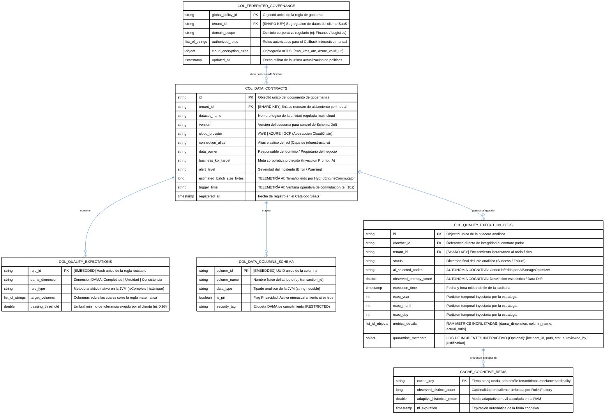

# 🎻 Orchestra Data Labs - Autonomous Data Engine (ADO)

El **Autonomous Data Engine (ADO)** es la plataforma inteligente, soberana y auto-conmutable de nivel empresarial (**Tier-1**) desarrollada por **Orchestra Data Labs**. Actúa como una aduana universal y centralizada para la calidad, resiliencia y gobernanza activa de datos en arquitecturas distribuidas modernas (*Data Mesh*).

ADO opera de forma 100% agnóstica en entornos **Multi-Cloud** (AWS, Azure, GCP) y **On-Premise**, unificando el procesamiento de datos masivos en lotes (**Batch**) y flujos continuos en tiempo real (**Streaming**) bajo un único plano de control de gobierno de datos transaccional y multi-inquilino [DAMA].

## 🧱 1. Matriz de Capacidades y Características Core del Motor (ADO)

<div style="padding: 30px; border: 2px solid currentColor; border-radius: 12px; margin-bottom: 25px; font-family: -apple-system, BlinkMacSystemFont, 'Segoe UI', Roboto, sans-serif;">

  <h2 style="margin-top: 0; margin-bottom: 20px; font-size: 22px; font-weight: 800; border-bottom: 2px solid currentColor; padding-bottom: 8px;">
    ⚡ ARQUITECTURA SOBERANA TIER-1: CONSOLIDACIÓN DE CAPACIDADES ANALÍTICAS
  </h2>
  <p style="font-size: 14px; margin-bottom: 25px; line-height: 1.6; opacity: 0.9;">
    El <strong>Autonomous Data Engine (ADO)</strong> unifica las mejores prácticas de la industria en rigor de gobernanza y control masivo de calidad con un ecosistema propietario de inteligencia adaptativa, auto-conmutación continua y aislamiento elástico perimetral bajo el estándar DAMA-DMBOK2.
  </p>

  <h3 style="font-size: 16px; font-weight: 800; margin-top: 20px; margin-bottom: 10px;">🏛️ BLOQUE A: Capacidades de Auditoría Pesada (Rigor Estadístico Industrial)</h3>
  <ul style="line-height: 1.6; font-size: 13.5px; padding-left: 20px; margin-bottom: 25px; opacity: 0.85;">
    <li><strong>Matriz de 5 Dimensiones Core DAMA</strong>: Evaluación y perfilado de datos de alta fidelidad directamente en la RAM distributiva para la validación de <em>Completitud</em> (isComplete), <em>Unicidad</em> (isUnique), <em>Consistencia</em> (isConsistent), <em>Precisión</em> (isPrecise) y <em>Actualidad</em> (isCurrent).</li>
    <li><strong>Data Verification Suite Declarativo</strong>: Abstracción completa de lógica rígida (hardcoded). El clúster JVM interpreta dinámicamente un presupuesto de calidad estructurado en un Manifiesto JSON Declarativo enviado por la API y autogenera los planes lógicos de ejecución en caliente.</li>
    <li><strong>Cómputo Unificado en un Solo Pase (Single Pass)</strong>: Optimización masiva de rendimiento en Big Data. El motor escanea el DataFrame una única vez, consolidando múltiples acumuladores matemáticos en memoria y evitando el re-escaneo costoso del almacenamiento físico.</li>
  </ul>

  <h3 style="font-size: 16px; font-weight: 800; margin-top: 25px; margin-bottom: 10px;">🧠 BLOQUE B: Capacidades Autónomas y Predictivas (Propiedad Intelectual Orchestra Labs)</h3>
  <ul style="line-height: 1.6; font-size: 13.5px; padding-left: 20px; margin-bottom: 10px; opacity: 0.85;">
    <li><strong>Cómputo Conmutable Híbrido Automático (Batch & Stream)</strong>: El componente central <code>HybridEngineCommutator.scala</code> analiza en microsegundos la telemetría del contrato (<em>estimatedBatchSizeBytes</em>) y conmuta el procesamiento de forma transparente entre Apache Spark (Near-Real Time para ráfagas masivas) y Apache Flink (Real-Time continuo registro por registro).</li>
    <li><strong>Timbrado de Cardinalidad en Caliente hacia Redis</strong>: En lugar de volcar bitácoras pasivas en archivos de disco, el componente <code>RulesFactory.scala</code> inyecta el conteo de elementos únicos (distinct count) de forma instantánea en <code>Redis Stack Core</code> vía Jedis, alimentando el bucle de inferencia en nanosegundos.</li>
    <li><strong>Optimización de Almacenamiento por IA (AiStorageOptimizer)</strong>: Un agente cognitivo asíncrono interroga la caché histórica de Redis, autoevalúa el nivel de entropía del dato del inquilino y selecciona autónomamente el mejor códec de compresión transaccional (Snappy, Gzip, Zstd) junto con el particionamiento físico ideal antes del guardado.</li>
    <li><strong>Aislamiento Elástico Perimetral Multi-Tenant</strong>: Blindaje físico absoluto regulado por DAMA. Cada petición HTTP, tópico/partición en <code>Azure Event Hubs</code> (enrutado mediante <em>PartitionKey = tenant_id</em>) y registro analítico viaja atado de fábrica a la identidad del cliente (<em>X-Tenant-ID</em>), impidiendo la contaminación cruzada.</li>
    <li><strong>Interoperabilidad Inter-Nube Simultánea (CloudChain)</strong>: Abstracción elástica de persistencia mediante el patrón de diseño <em>Chain of Responsibility</em>. Capaz de leer un lote analítico de una nube (GCP <code>gs://</code>), validarlo en la RAM de Colima/Docker, desviar rechazos de calidad a una ruta de cuarentena en una segunda nube (AWS <code>s3a://</code>) y asentar el log de éxito inmutable en una tercera (Azure <code>abfss://</code>) en un solo pipeline.</li>
  </ul>

</div>


---

## 📐 Características Arquitectónicas

1. **Gobernanza Activa (DAMA-DMBOK2):** Traduce automáticamente los resultados técnicos de los clústeres en las 5 Dimensiones Core de negocio: *Completitud, Unicidad, Consistencia, Precisión y Actualidad*, persistiendo evidencias inmutables para auditorías [DAMA].
2. **Cómputo Conmutable Híbrido:** Ejecución nativa en Scala dentro de la JVM (`com.orchestra.ado`). Conmuta de forma automática y transparente entre **Apache Spark + Deequ** (para auditorías analíticas pesadas) y **Apache Flink** (para streaming registro por registro con latencia de milisegundos).
3. **Interoperabilidad Inter-Nube Simultánea:** Capaz de leer de una nube (ej: GCP `gs://`), validar en memoria, desviar errores a otra (ej: AWS `s3a://`) y persistir el gobierno en una tercera (ej: Azure `abfss://`) en un solo pipeline gracias a su patrón *Chain of Responsibility*.
4. **Capa Cognitiva GenAI (Self-Healing):** Implementa *Pandas UDFs* vectorizados asíncronos para detección de anomalías semánticas y ejecuta un bucle de mejora continua donde la IA analiza las bitácoras históricas y evoluciona las reglas de calidad de forma autónoma [DAMA].
5. **Resiliencia Operativa & Human-in-the-Loop:** Protegido por un *Circuit Breaker* con redirección automática a almacenamiento local de emergencia. Si hay alertas grises, congela el flujo y envía una notificación interactiva con botones a **Slack/Teams** esperando la confirmación del *Data Owner*.

---
<div style="background-color: #ffffff !important; padding: 35px; border: 1px solid #e2e8f0; border-radius: 8px; color: #000000 !important; margin-bottom: 35px; width: 100%; min-width: 1600px !important; overflow-x: auto; box-shadow: 0 4px 6px -1px rgba(0, 0, 0, 0.05);">

### 1. Diagrama de Componentes (Estructura Física y Desacoplamiento)

<div style="background-color: #FFFFFF; color: #000000; padding: 30px; border: 3px solid #000000; border-radius: 12px; box-shadow: 0 4px 6px -1px rgba(0, 0, 0, 0.1); margin-bottom: 25px; font-family: -apple-system, BlinkMacSystemFont, 'Segoe UI', Roboto, sans-serif;">

  <h2 style="color: #0056B3; margin-top: 0; margin-bottom: 5px; font-size: 22px; font-weight: 700; border-bottom: 2px solid #002244; padding-bottom: 8px; background-color: #FFFFFF;">
    🧱 ARQUITECTURA DE COMPONENTES DE 'AUTONOMOUS-DEEQU-ORCHESTRATOR'
  </h2>
  <p style="color: #000000; font-size: 13px; margin-bottom: 25px; line-height: 1.5; background-color: #FFFFFF;">
    Estructura modular de la suite propietaria. Describe la interacción del Control Plane en Python con el motor analítico nativo desde cero en la JVM de Spark, aplicando sharding por cliente e inyección multi-nube [DAMA].
  </p>
</div>

  ```mermaid
%%{init: {
  'theme': 'base', 
  'themeVariables': { 
    'fontSize': '30px', 
    'actorBkg': '#ffffff',
    'actorBorder': '#000000',
    'actorTextColor': '#000000',
    'signalColor': '#0056B3',
    'signalTextColor': '#000000',
    'labelBoxBkgColor': '#ffffff',
    'labelBoxBorderColor': '#000000',
    'labelTextColor': '#000000'
  },
  'themeCSS': 'svg { background-color: #ffffff !important; } text, span, p, tspan { color: #000000 !important; fill: #000000 !important; font-weight: bold !important; font-size: 20px !important; } .connection { stroke: #0056B3 !important; stroke-width: 2.5px !important; } .messageText { fill: #000000 !important; font-size: 18px !important; }'
}}%%
sequenceDiagram
    participant Cliente as Clientes SaaS
    participant APP as GatewayAPI
    participant MID as TenantMiddleware
    participant HUB as AzureEventHubs
    participant MAIN as MainScalaJVM
    participant COMM as HybridEngineCommutator
    participant STORAGEOPT as AiStorageOptimizer
    participant CC as CloudChain
    participant RF as RulesFactory
    participant ENGINE_MET as MetricsEngine
    participant STRAT as GovernedSaveStrategy
    participant REDIS as RedisStackCore
    participant CLOUD as CloudStorage
    participant MW as MetadataWriter

    Cliente->>APP: POST pipelines execute
    activate APP
    APP->>MID: Validar X-Tenant-ID
    activate MID
    MID-->>APP: Tenant aislado
    deactivate MID
    APP->>APP: Timbrar Contrato Pydantic
    APP->>HUB: send_batch con PartitionKey
    activate HUB
    HUB-->>APP: ACK de confirmacion
    deactivate HUB
    APP-->>Cliente: HTTP 202 ACCEPTED
    deactivate APP

    HUB->>MAIN: Consumo asincrono
    activate MAIN
    
    MAIN->>COMM: Evaluar volumen y latencia del contrato
    activate COMM
    COMM-->>MAIN: Conmutacion decidida (Spark o Flink)
    deactivate COMM

    MAIN->>STORAGEOPT: Solicitar estrategia almacenamiento
    activate STORAGEOPT
    STORAGEOPT->>REDIS: Consultar cache cardinalidad
    activate REDIS
    REDIS-->>STORAGEOPT: Retornar codecs
    deactivate REDIS
    STORAGEOPT-->>MAIN: Estrategia generada
    deactivate STORAGEOPT

    MAIN->>CC: Inicializar conectores
    activate CC
    CC->>CLOUD: Cargar DataFrame en RAM
    activate CLOUD
    CLOUD-->>CC: Data listo
    deactivate CLOUD
    CC-->>MAIN: Conexion establecida
    deactivate CC

    MAIN->>RF: invocar evaluateBudget
    activate RF
    RF->>RF: Agregaciones Catalyst Native
    RF->>ENGINE_MET: Acumular metricas DAMA
    activate ENGINE_MET
    ENGINE_MET-->>RF: Metricas consolidadas
    deactivate ENGINE_MET
    RF->>REDIS: Timbrar perfiles de cardinalidad en caliente
    RF-->>MAIN: Datos procesados
    deactivate RF

    MAIN->>STRAT: applySaveStrategy
    activate STRAT
    STRAT->>CLOUD: Desviar lote analitico
    STRAT->>MW: Asentar auditoria de gobernanza
    activate MW
    MW-->>STRAT: Auditoría confirmada
    deactivate MW
    STRAT-->>MAIN: Ciclo finalizado
    deactivate STRAT
    deactivate MAIN
```
  <div style="margin-top: 20px; font-size: 13px; color: #000000; line-height: 1.5; background-color: #FFFFFF; padding: 15px; border: 2px solid #0056B3; border-radius: 6px;">
    <span style="color: #0056B3; font-weight: bold;">🛡️ REGLA DE INTERACCIÓN DE COMPONENTES:</span> El orquestador desacopla por completo las librerías heredadas de terceros. La suite <code>RulesFactory.scala</code> inyecta expresiones funcionales directamente sobre la RAM distributiva, resolviendo la seguridad de almacenamiento mediante la <code>CloudChain</code> y optimizando la persistencia a través de la IA de <code>AiStorageOptimizer</code> de forma soberana para cada inquilino [DAMA].
  </div>
</div>


---

##  🔄 3. Flujo de Orquestación E2E (Diagrama de Secuencia)


Este diagrama detalla cómo interactúan secuencialmente los componentes del plano de control, la arteria AMQP, el motor JVM en Scala y los servicios de infraestructura externos:

### Flujo Dinámico E2E (Diagrama de Secuencia)

Este diagrama detalla cómo interactúan secuencialmente los componentes del plano de control, la arteria AMQP, el motor JVM en Scala y los servicios de infraestructura externos:

<div style="background-color: #ffffff !important; padding: 35px; border: 1px solid #e2e8f0; border-radius: 8px; color: #000000 !important; margin-bottom: 35px; width: 100%; min-width: 1600px !important; overflow-x: auto; box-shadow: 0 4px 6px -1px rgba(0, 0, 0, 0.05);">
</div>

## 🗄️ 4. Modelo de Datos de Gobierno y Persistencia Delta Lake (DAMA)

Estructura desnormalizada unificada basada en patrones de consulta analíticos eficientes. Toda la gobernanza corporativa, el diccionario PII de privacidad, las dimensiones del marco DAMA y las reglas de Deequ se consolidan en objetos auto-tenidos para optimizar el rendimiento del plano de datos multi-inquilino (*multi-tenant*) [DAMA].

<div style="background-color: #ffffff !important; padding: 35px; border: 1px solid #e2e8f0; border-radius: 8px; color: #000000 !important; margin-bottom: 35px; width: 100%; min-width: 1600px !important; overflow-x: auto; box-shadow: 0 4px 6px -1px rgba(0, 0, 0, 0.05);">

  <h2 style="color: #0056B3; margin-top: 0; margin-bottom: 5px; font-size: 22px; font-weight: 700; border-bottom: 2px solid #002244; padding-bottom: 8px; background-color: #FFFFFF;">
    📦 MAPA DE DOCUMENTOS Y SUBESTRUCTURAS NOSQL
  </h2>
  <p style="color: #000000; font-size: 13px; margin-bottom: 25px; line-height: 1.5; background-color: #FFFFFF;">
    Esquema documental sin JOINs. Las dimensiones de calidad DAMA y las reglas analíticas de Deequ operan como objetos embebidos dentro de cada contrato de datos segregado por cliente.
  </p>
  ### 3. Modelo de Datos Relacional y Capa Cognitiva de Inferencia (ER Diagram)



</div>
<div style="background-color: #ffffff !important; padding: 35px; border: 1px solid #e2e8f0; border-radius: 8px; color: #000000 !important; margin-bottom: 35px; width: 100%; min-width: 1600px !important; overflow-x: auto; box-shadow: 0 4px 6px -1px rgba(0, 0, 0, 0.05);">
  <span style="color: #0056B3; font-weight: bold;">🛡️ REGLA DE RENDIMIENTO EN ARRAYS (EMBEDDING):</span> Al modelar el diccionario (<code style="color: #000000;">COL_DATA_COLUMNS_SCHEMA</code>) y las reglas reutilizables (<code style="color: #000000;">COL_QUALITY_EXPECTATIONS</code>) como subdocumentos embebidos adentro de la colección core de contratos, la API Gateway lee y transmite toda la topología regulatoria en un único viaje de red. El campo <code style="color: #0056B3; font-weight: bold; background-color: #FFFFFF;">tenant_id</code> opera como **Shard Key** inmutable para garantizar aislamiento perimetral físico [DAMA].
</div>

</div>

---


## 📂 4.Estructura Completa del Repositorio


```text
autonomous-deequ-orchestrator/                  # Raíz del Repositorio PoC Multi-Cloud
├── core-models/                                # 🟢 MÓDULO 1: Contratos Declarativos e Inmutables DAMA
│   ├── src/
│   │   └── main/
│   │       └── scala/
│   │           └── com/
│   │               └── orchestra/
│   │                   └── ado/
│   │                       └── models/
│   │                           └── DataContract.scala  # Caso de uso: Esquemas, PII y Metadatos elásticos con telemetría de bytes
│   └── build.sbt
│
├── spark-runtime/                              # 🟢 MÓDULO 2: Data Plane Distribuido (Spark Engine JVM)
│   ├── src/
│   │   └── main/
│   │       └── scala/
│   │           └── com/
│   │               └── orchestra/
│   │                   └── ado/
│   │                       ├── ai/
│   │                       │   └── GenAiValidator.scala      # Capa Cognitiva: Caché Semántica Jedis/Redis
│   │                       ├── quality/
│   │                       │   ├── HybridEngineCommutator.scala # ⚡ [NUEVO] Selector autónomo de motor (Spark vs Flink) basado en telemetría
│   │                       │   ├── RulesFactory.scala        # Fábrica elástica de reglas DAMA Catalyst con timbrado en Redis
│   │                       │   ├── GovernedSaveStrategy.scala # Coalesce y Particionamiento transaccional por tenant_id usando códecs predictivos
│   │                       │   └── AiStorageOptimizer.scala   # ⚡ Agente de IA para selección de Códecs y Particionado basado en entropía
│   │                       ├── storage/
│   │                       │   └── CloudChain.scala          # Fábrica de conectores multi-nube (AWS, Azure, GCP)
│   │                       ├── utils/
│   │                       │   └── MetadataWriter.scala      # Persistencia de telemetría histórica y incidentes de gobernanza
│   │                       └── Main.scala                    # Orquestador analítico central de la JVM conectado a Azure Event Hubs
│   └── build.sbt
│
├── flink-runtime/                              # 🟢 MÓDULO 3: Stream Plane Continuo (Flink Engine JVM)
│   ├── src/
│   │   └── main/
│   │       └── scala/
│   │           └── com/
│   │               └── orchestra/
│   │                   └── ado/
│   │                       └── stream/
│   │                           └── EventConsumer.scala       # Consumidor elástico conectado nativamente a Azure Event Hubs
│   └── build.sbt
│
├── gateway-api/                                # 🟢 MÓDULO 4: Control Plane Perimetral (Python FastAPI)
│   ├── src/
│   │   ├── app.py                              # Servidor asíncrono con Lifespan de Azure Event Hubs y Aislamiento X-Tenant-ID
│   │   ├── test_gateway.py                     # Suite de pruebas unitarias en memoria (pytest) en verde con inyección de Tenant-ID
│   │   └── test_dataops_e2e.py                 # Suite de integración DataOps E2E conectada a Redis/EventHubs
│   └── requirements.txt                        # Dependencias de Python corporativas enriquecidas con azure-eventhub
│
├── infra/                                      # 🟢 MÓDULO 5: Infraestructura como Código (Pulumi IaC)
│   ├── __main__.py                             # Topología elástica declarativa: Azure Event Hubs, Redis y NetworkPolicies
│   ├── Pulumi.yaml
│   └── Pulumi.dev.yaml
│
├── .venv/                                      # Entorno virtual aislado de Python 3.12 activo
├── .pytest_cache/                              # Caché aislada de aserciones de red de la terminal
├── target/                                     # Binarios locales compilados por la JVM de Java
├── project/                                    # Configuraciones globales de compilación de sbt
│   ├── build.properties                        
│   └── plugins.sbt                             # Estrategia de ensamble corporativa (sbt-assembly)
├── build.sbt                                   # Manifiesto unificado agregador de dependencias raíz (Spark 3.5.0 / Flink 1.18.1)
└── README.md                                   # Documentación técnica con diagramas de alto contraste
```


---

## 🔒 5. Directrices de Seguridad y DataOps Incorporadas

*   **Zero-Knowledge Credentialing:** Se eliminan las llaves estáticas. Utiliza *Workload Identity* federado (IRSA en AWS, Managed Identity en Azure) asignado al Pod de Kubernetes en tiempo de ejecución.
*   **mTLS In-Transit:** Todo el tráfico entre los nodos ejecutores de Spark/Flink y los brokers de Apache Pulsar/Kafka está cifrado bajo protocolos estrictos de TLS mutuo.
*   **Particionamiento Multinivel Temporal:** Los datos validados se guardan indexados automáticamente bajo la estructura `/year=YYYY/month=MM/day=DD/` con técnicas de coalescencia para evitar el problema de archivos pequeños (*Small File Problem*).
*   **GDPR/PII Data Masking:** Las columnas marcadas con `"pii": true` son transformadas de forma nativa en la JVM mediante criptografía SHA-256 antes de tocar cualquier zona física del Data Lake [DAMA].

---

## 🛠️ 6. Guía de Inicio Rápido

### 1. Compilación de los Runtimes (Scala)
Para compilar y empaquetar de forma aislada los submódulos libres de colisiones en la JVM, ejecuta en la raíz:
```bash
sbt compile
sbt assembly
```

### 2. Despliegue de la Infraestructura de la API (Pulumi)
Para aprovisionar los pods vectorizados, las redes aisladas (`NetworkPolicies`) y el auto-escalador **KEDA** basado en el lag de la cola de eventos, ejecuta:
```bash
cd infra
pip install -r requirements.txt
pulumi up
```
***

Con este `README.md` creado, el repositorio de tu compañía cuenta con una documentación de nivel internacional. 

Para avanzar hacia el desarrollo del primer componente físico de **Orchestra Data Labs**, indícame con cuál empezamos:
1. Codificar el archivo de **Contratos Inmutables (`core-models/.../Payload.scala`)** para congelar la estructura inter-nube.
2. Escribir el código del **FastAPI Gateway (`gateway-api/src/app.py`)** para habilitar la compuerta REST de control.
3. Desarrollar la **`RulesFactory.scala`** para empezar a inyectar las dimensiones DAMA sobre Spark [DAMA].


---

## 🎨 6. Patrones de Diseño de Software Implementados

### 🟢 A. Patrón Contract (Módulo `core-models`)
* **Propósito:** Mitigar el *Schema Drift* y congelar las expectativas de negocio en un contrato JSON inmutable.
* **Componente:** `com.orchestra.ado.models.ElitePipelinePayload`
* **Gobernanza DAMA:** Define estructuralmente el tipado estricto de las 5 dimensiones core (Precisión, Completitud, Consistencia, Unicidad y Actualidad).

### 🟢 B. Patrón Chain of Responsibility (Módulo `spark-runtime / storage`)
* **Propósito:** Habilitar la interoperabilidad multi-nube simultánea de forma transparente en memoria, aislando los drivers físicos de almacenamiento de los scripts de datos.
* **Componente:** `com.orchestra.ado.storage.CloudStorageHandler`
* **Eslabones:**
  * `GcsCloudHandler` (`gs://`) -> Intercepta Google Cloud Storage.
  * `AwsS3CloudHandler` (`s3a://`) -> Configura credenciales federadas de AWS IAM.
  * `AzureAdlsCloudHandler` (`abfss://`) -> Inicializa tokens seguros de Microsoft Azure.

### 🟢 C. Patrón Strategy (Módulo `spark-runtime / quality`)
* **Propósito:** Desacoplar las políticas de persistencia según el dictamen del motor analítico.
* **Componente:** `com.orchestra.ado.quality.GovernedSaveStrategy`
* **Mecanismo:** Si el lote es exitoso, fuerza una coalescencia de hilos de la JVM para prevenir el *Small File Problem* y aplica un particionamiento jerárquico temporal multinivel (`/year/month/day/`) en el Data Lake.

---

## 🐳 7. Estrategia de Empaquetado Multi-Stage (Docker)

Para mantener la imagen de producción optimizada y con un blindaje militar, el archivo `Dockerfile.runtimes` implementa dos etapas:
* **Stage 1 (Builder):** Descarga las dependencias pesadas de Maven Central y compila el compilador de Scala (`sbt compile`), filtrando archivos duplicados mediante *Merge Strategies*.
* **Stage 2 (Runtime Final):** Basado en una imagen ultra-ligera de Linux con **Java 21 LTS**, hereda únicamente el *Fat JAR* resultante, eliminando herramientas de compilación para reducir la superficie de ataques informáticos.

---


## 🚀 8. Guía de Operación Rápida
Para encender el plano de control local en el puerto `8000` y enviar un contrato de prueba:

```bash
# 1. Levantar el contenedor actualizado en la interfaz universal de Colima (Versión 4.0.0)
docker run -d -p 8000:8000 --name orchestra-platform orchestra/data-governance-plane:4.0.0

# 2. Ejecutar la simulación de aprobación enviando la cabecera mandatoria de aislamiento DAMA
curl -X POST "http://localhost:8000/api/v1/governance/quarantine/callback?action=approve&dataset_name=Core_Transactions" \
     -H "accept: application/json" \
     -H "X-Tenant-ID: tenant-talos-poc-01"
```