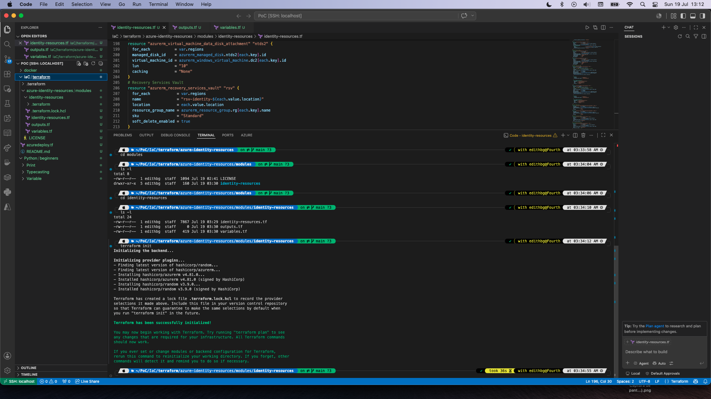

# 🚀 Terraform-Modules-Azure

## 📋 Table of Contents

- Policy Definitions
- Policy Set Definitions
- Policy Assignments
- Policy Remediations

```text
├── README.md
├── azure-identity-resources
│   └── modules
│       ├── LICENSE
│       └── identity-resources
│           ├── identity-resources.tf
│           ├── outputs.tf
│           └── variables.tf
├── azuredeploy.tf
└── images
    └── TerraforInit.png

## 📋 Terraform Init



## 📋 Terraform modules

Terraform modules enable the organization, reuse, and encapsulation of infrastructure-as-code configurations through the following key capabilities: Component reuse: They define sets of resources for specific functions—such as networking, applications, or databases—that can be applied across multiple projects or environments. 

Abstraction and encapsulation: They hide technical complexity behind a clean interface, making infrastructure easier to read, maintain, and manage. Consistency and standardization: They ensure reliable deployments across any environment by directly incorporating organizational best practices and policies. Flexible parameterization: They allow resource behavior to be customized via input variables, adapting to various use cases without code duplication. Version control: They track changes over time and pin explicit dependencies to ensure that every deployment is predictable and reproducible. Centralized collaboration: They facilitate code sharing between teams via registries like the Terraform Registry, accelerating development times.
